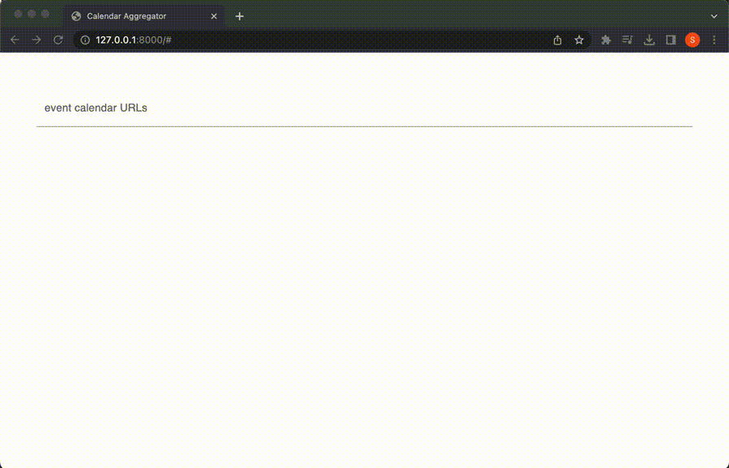

# Calendar Aggregator

Calendar Aggregator takes URLs of event calendars that interest you, fetches events from those calendars, and displays them in one unified calendar. You can bookmark the Calendar Aggregator with your URL collection so that a list of all upcoming events that might interest you is always just one click away.

## Some limitations
* Currently, Calendar Aggregator fetches the HTML for a given event calendar URL and then extracts events from it. Therefore, for SPAs that do not include the events they display in the initial HTML, no events can be extracted.
* The event extraction is rule-based and, currently, not very sophisticated. Consequently, it often fails to extract events from event calendars even if information about those events is included in the HTML.
* Calendar Aggregator is not hardened for production use. For example, malicious users could use Calendar Aggregator for a reflection-based DOS attack by repeatedly requesting to extract events from `www.victim-website.com`.

## Launching locally
1. Run `docker-compose --env-file .env.dev build && docker-compose --env-file .env.dev up` in the project's directory.
2. Navigate to `http://127.0.0.1:8000`.